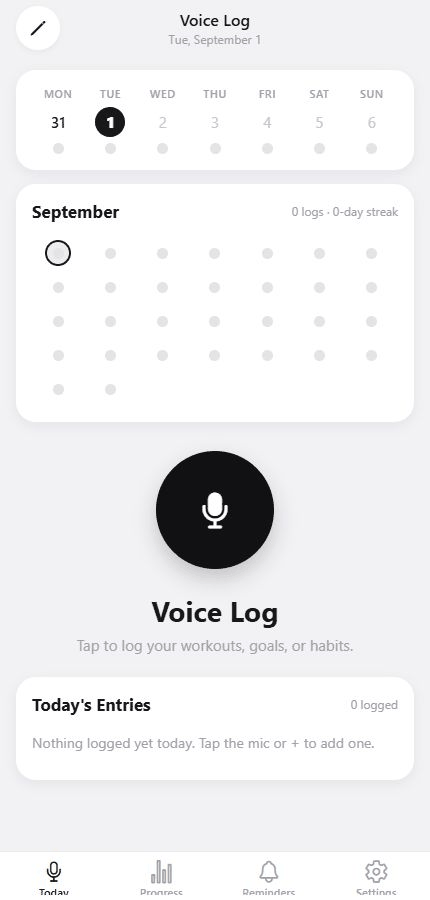

# Voice Log

I built Voice Log because I kept putting off habit tracking. The activity itself
was easy; opening a tracker and typing every exercise, set, page, or minute was
the part I avoided. Speaking one short recap felt much more natural.

Tap the mic and say something like: “I read 25 pages, then did four sets of bench
press at 80 kilos.” Voice Log turns that into separate, editable entries and
keeps the progress on the device.



## How it works

The voice path is **Expo → Supabase → Gemini → SQLite**:

1. The Expo app records a short audio clip.
2. A Supabase Edge Function checks the personal access token, file size, format,
   rate limit, and request fields.
3. Gemini transcribes the clip and returns structured activities and measures.
4. The app shows the proposed entries for confirmation, then writes the approved
   data to SQLite.

The recording is a temporary file and is deleted after the request. Habit
history, goals, categories, streaks, and reminders stay in the local SQLite
database. The Gemini API key only exists as a Supabase secret.

## What is included

- voice entry in English, Russian, and Arabic
- manual add/edit/delete as a fallback
- multiple measures per activity: duration, distance, pages, sets, reps, weight,
  calories, and custom counts
- unit-safe progress totals (hours/minutes, miles/kilometres, and pounds/kilos)
- weekly goals, streaks, categories, and local reminders
- a review step before speech results are saved, plus an immediate undo
- 15 unit tests covering metric conversion, validation, dates, streaks, and goal
  calculations
- lint, TypeScript, tests, and a production web export in GitHub Actions

## Run it locally

You need Node.js 22+, Expo Go or a simulator, a Supabase project, and a Gemini
API key.

```bash
npm install
cp .env.example .env
```

Fill in the three values in `.env`:

```dotenv
EXPO_PUBLIC_SUPABASE_URL=https://YOUR_PROJECT.supabase.co
EXPO_PUBLIC_SUPABASE_ANON_KEY=YOUR_SUPABASE_ANON_KEY
EXPO_PUBLIC_VOICE_LOG_ACCESS_TOKEN=THE_SAME_LONG_RANDOM_VALUE_USED_ON_SUPABASE
```

Set the private Edge Function secrets and deploy:

```bash
npx supabase login
npx supabase link --project-ref YOUR_PROJECT_REF
npx supabase secrets set GEMINI_API_KEY=YOUR_GEMINI_KEY
npx supabase secrets set VOICE_LOG_ACCESS_TOKEN=YOUR_LONG_RANDOM_VALUE
npx supabase secrets set ALLOWED_ORIGIN=http://localhost:8081
npx supabase functions deploy parse-log
npx expo start --clear
```

`ALLOWED_ORIGIN` is only needed for the web client; use the exact deployed web
origin in production. Native requests do not rely on browser CORS.

## Privacy and security

No working keys or project values belong in Git. `.env`, Supabase local state,
mobile signing files, and service configuration files are ignored.

The Supabase anon key is designed to be public. The additional access token makes
the deployed function private enough for my own non-distributed build, but an
`EXPO_PUBLIC_...` value is still bundled into a shipped app and can be
extracted. If this becomes a public product, the next security step is Supabase
Auth with per-user JWT validation and server-side quotas; a bundled token should
not be treated as user authentication.

Audio leaves the device only after the first-use disclosure is accepted. It goes
to the owner's Supabase function and then to Google Gemini. The function does not
store the audio, and the app removes its temporary copy after processing.

## Checks

```bash
npm run verify
```

That runs ESLint, TypeScript, all 15 Vitest tests, and the Expo web export.

## Current limits

- Voice parsing needs a network connection.
- Gemini can mishear speech, so every proposed entry must be reviewed.
- The web SQLite driver needs cross-origin isolation headers. The included Expo
  Router and Metro configuration supplies them; embedded previews that disable
  `SharedArrayBuffer` fall back to a non-persistent empty preview.
- This is currently a personal, single-device app. There is no account sync or
  cloud backup.
